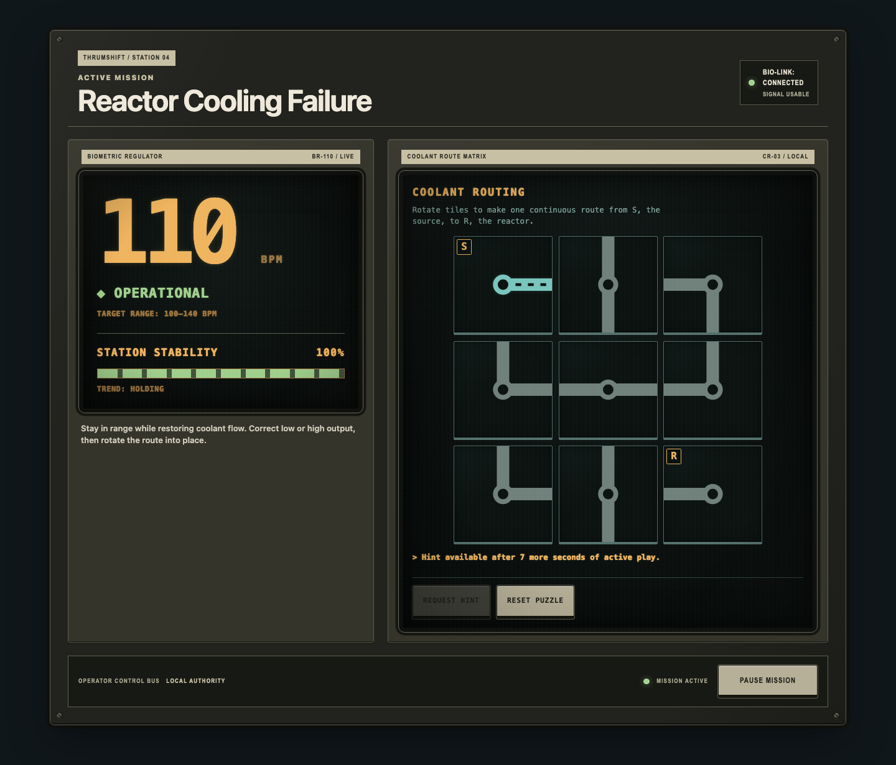
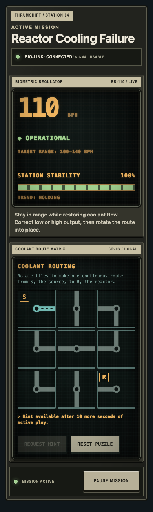
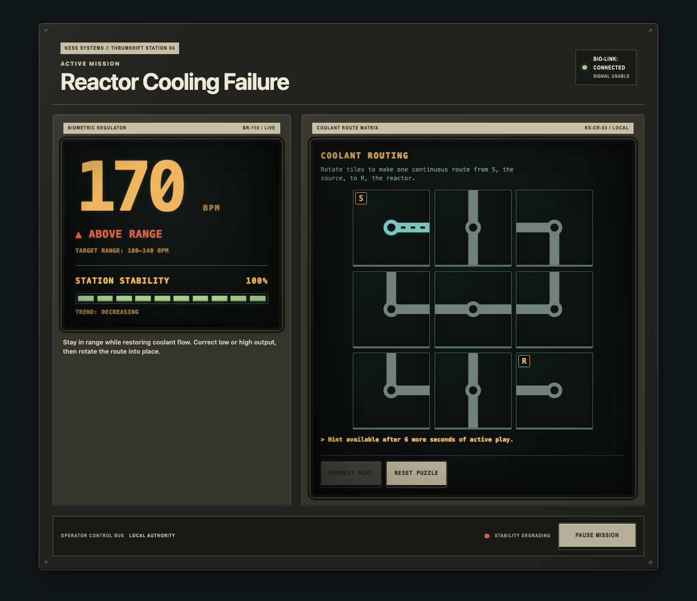
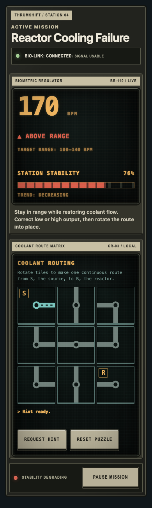

# Active gameplay visual-system spike

This spike translates the Thrumshift FigJam direction into the representative active-mission state at desktop and narrow-mobile widths: stable 110 BPM telemetry and 100% station stability. It deliberately preserves the current information architecture, game rules, control behavior, accessibility semantics, and puzzle model.

## Visual thesis

Thrumshift is installed station equipment, not a themed web dashboard. The physical layer is a dark, substantial enclosure with printed plates, fasteners, recessed instruments, and a fixed control deck. The information layer is simpler: sparse monochrome CRT graphics, one dominant number, concise state language, and functional diagrams. Color indicates machine state and never becomes ambient decoration.

## Reusable primitives

- `equipment-shell`: the outer installed enclosure. It owns the casing, edge treatment, fasteners, primary spacing, and control deck.
- `equipment-module`: a serviceable subsystem bay. Modules are separated by casing and a printed equipment label, not by floating card elevation.
- `equipment-label`: a high-contrast cream plate for subsystem name and asset/status identifier. Labels use compact uppercase industrial typography.
- `crt-display`: a recessed information surface. Curvature, edge darkening, scanlines, and glow are restricted to this layer. Scanlines must remain visible in stills but unobtrusive while reading.
- `control-deck`: the persistent command row for current mode and high-level actions. Controls communicate ongoing state; important actions are visually separated from routine puzzle input.
- `status-lamp`: a persistent indicator paired with text. Illumination reports equipment state and is never used as click celebration.
- `segmented-indicator-bank`: ten persistent rectangular lamps used for quantized qualification and station reserve. It changes discrete lamp states rather than animating a fill width.

## Typography roles

1. Equipment shell: condensed uppercase sans, wide tracking, concise subsystem and asset labels.
2. CRT telemetry and schematics: monospace, tabular numerals, short uppercase state messages.
3. Instructions and dialogs: readable system sans at conventional text sizes. Body copy does not inherit the CRT treatment.

## Color roles

- Warm black and charcoal: canvas, casing, and display glass.
- Muted cream: printed plates, physical controls, and primary shell text.
- Amber: primary telemetry, display headings, target ranges, and neutral operational prompts.
- Green: confirmed healthy/persistent operating state.
- Cyan: live coolant flow and schematic emphasis.
- Red: out-of-range or critical state only. It is not used in the stable reference screen.

Every semantic color is paired with text, shape, pattern, or position. Color alone never carries gameplay meaning.

Out-of-range classification also carries direction independent of color: `▲ ABOVE RANGE` and `▼ BELOW RANGE`. Operational and pending states retain the neutral `◆` and `◇` markers.

## Layout rules

- Desktop uses one console frame with a top identity/status rail, two unequal equipment bays, and a bottom command row.
- The telemetry bay is the dominant readout; the routing bay is the active service surface.
- The 110 BPM value is the first focal point. Station stability is secondary but remains in the same familiar instrument.
- The coolant puzzle remains a 3×3 schematic and retains its existing instruction, hint, and reset hierarchy.
- Mobile keeps the same visual identity but stacks modules and reduces framing density before reducing control size or legibility.
- At 390px, the outer enclosure loses its corner fasteners and uses shallower casing depth. Module label strips, recessed CRT edges, state lamps, and physical control faces remain because they carry the equipment identity.
- Narrow layouts condense secondary status metadata and omit the redundant control-bus legend. They do not shrink the coolant matrix, primary telemetry, or touch targets to recover space.
- Development diagnostics remain outside the product console and use a quieter service-panel treatment.
- The control-deck lamp and explicit state text track the same mission condition shown in telemetry: green `MISSION ACTIVE`, amber `STABILITY RECOVERING`, or red `STABILITY DEGRADING`.

## Motion and wear

- No decorative animation was added. Existing tile rotation feedback remains the only routine motion and still respects reduced-motion preferences.
- Wear is implied through material depth, assembled edges, and service labels rather than scratches, noise overlays, or arbitrary grunge.

## Review captures

