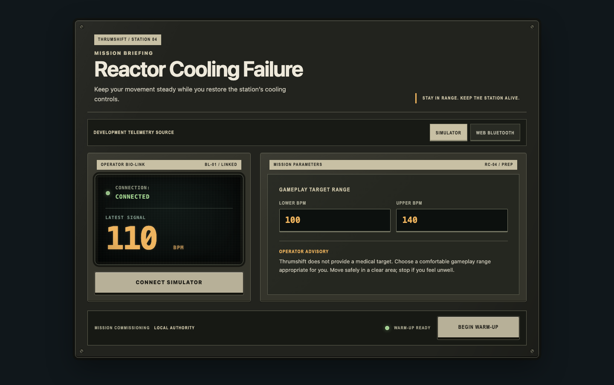
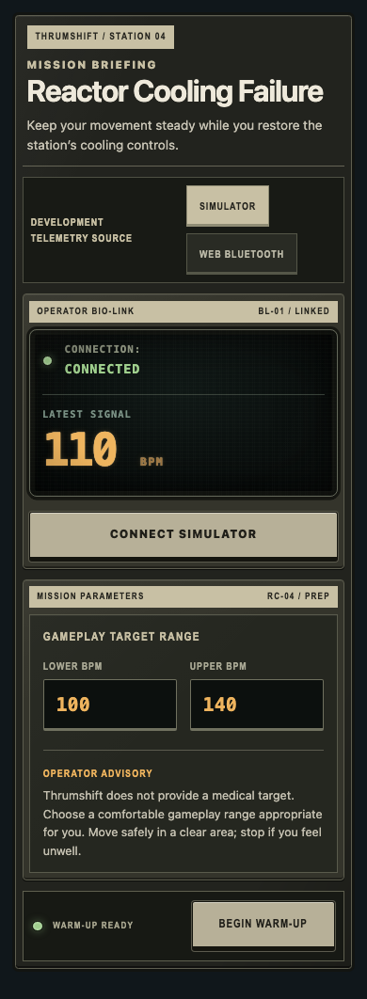

# Mission briefing visual-system rollout

The mission briefing extends the approved active-gameplay visual system without reproducing the active console's denser instrumentation layout. The reference state is connected at 110 BPM with a valid 100–140 BPM target range and warm-up available. Existing behavior, semantics, focus handling, validation, and mission flow remain unchanged.

## Composition

- The briefing uses the same installed `equipment-shell`, desktop fasteners, station plate, module framing, label strips, and physical control deck as active gameplay.
- Mission identity and briefing copy are printed on the enclosure. They remain outside the CRT treatment because they are operator instructions, not live instrumentation.
- The operator bio-link is the only recessed CRT surface. It contains only live connection state and the latest heart-rate signal.
- Mission parameters occupy a service panel with physical numeric inputs and a concise operator advisory. No decorative meters or additional telemetry are introduced.
- Readiness and the existing `Begin Warm-Up` action share the bottom control deck. The state lamp supplements explicit readiness text and does not carry meaning by color alone.
- The development-only telemetry selector is treated as a compact service switch bank. It remains outside the product instrumentation hierarchy.

## Typography and color

- Enclosure, asset, control, and state labels use the established condensed uppercase equipment role.
- Live bio-link values use the established monospace CRT role with restrained amber, green, and red semantics.
- Mission explanation and safety guidance use the readable system-text role without phosphor effects.
- Green means connected or ready, amber identifies live numeric values and advisories, and red is reserved for unavailable or error states.

## Responsive density

- Desktop uses two unequal bays: a compact bio-link instrument and a wider mission-parameter panel.
- At 390px the bays stack, fasteners and the motto plate are removed, enclosure depth is reduced, and the redundant control-bus legend is hidden.
- Module strips, recessed display edges, status lamps, full-size inputs, and primary actions remain. The two target values stay side by side at 390px and stack only below the ultra-narrow breakpoint.
- Mobile preserves readable copy and comfortable touch targets rather than scaling down the desktop console.

## Review captures

