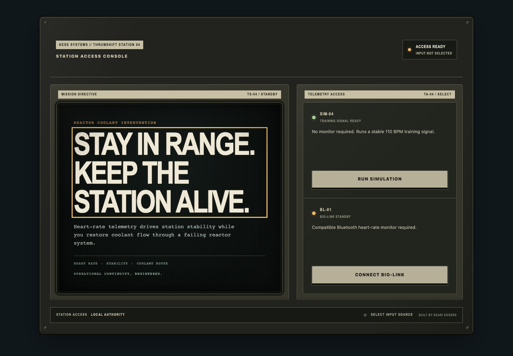
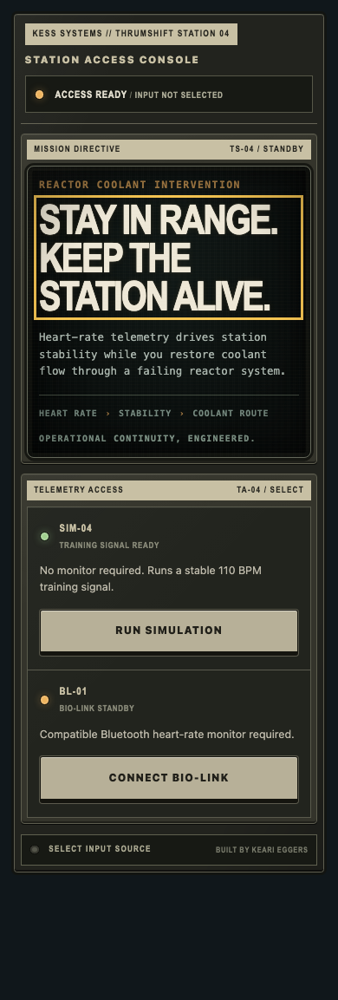

# Production launch-console visual system

The production launch console is a lightweight station-access state before the existing mission briefing. It explains the game in one glance and makes simulation a first-class entry path for visitors without a heart-rate monitor. It does not change the mission flow or introduce marketing-site conventions.

## Composition

- The launch state uses the established `equipment-shell`, fasteners, printed subsystem strips, restrained status lamps, recessed CRT treatment, and physical control deck.
- The mission-directive CRT carries the station identity, tagline, single-sentence premise, and a compact `HEART RATE › STABILITY › COOLANT ROUTE` relationship. It is the only large display surface.
- The telemetry-access bay contains two functional service channels rather than feature cards. Each channel pairs a persistent state lamp, concise requirement text, and one full-width physical control.
- A muted `Built by Keari Eggers` maker's link sits in the bottom control deck. It provides provenance without competing with either launch action.
- The page uses no screenshots, feature grids, decorative instruments, pricing, or marketing sections.

## Approved copy

- Identity: `KESS SYSTEMS // THRUMSHIFT STATION 04`
- State: `STATION ACCESS CONSOLE`
- Tagline: `Stay in range. Keep the station alive.`
- Premise: `Heart-rate telemetry drives station stability while you restore coolant flow through a failing reactor system.`
- Corporate line: `OPERATIONAL CONTINUITY, ENGINEERED.`
- Primary action: `RUN SIMULATION`
- Simulation note: `No monitor required. Runs a stable 110 BPM training signal.`
- Secondary action: `CONNECT BIO-LINK`
- Bio-link note: `Compatible Bluetooth heart-rate monitor required.`

## Launch behavior

- `RUN SIMULATION` enters the existing mission briefing with the simulated source selected, connected, and emitting a stable 110 BPM signal at the established HR6-like cadence. It requires no query string or development control.
- `CONNECT BIO-LINK` invokes the Web Bluetooth chooser directly from the operator's button gesture, then enters the same mission briefing with the hardware source selected.
- When Web Bluetooth is unavailable or the page is not a secure context, the bio-link control is disabled and the local requirement text explains the cause. Simulation remains available.
- The development diagnostics and source selector remain development-only. They are not included in the production launch or production bundle.

## Responsive equipment density

- Desktop uses a two-bay console: the directive CRT is visually dominant and the narrower access bay holds both launch paths.
- At 390px the bays stack in operational reading order: identity/status, directive, simulation, bio-link, and control state.
- Mobile removes fasteners and excess casing depth while retaining module strips, CRT framing, state lamps, legible copy, and full-width touch targets.
- The 390px layout has no horizontal overflow and uses one short vertical scroll rather than shrinking controls or type.

## Review captures

