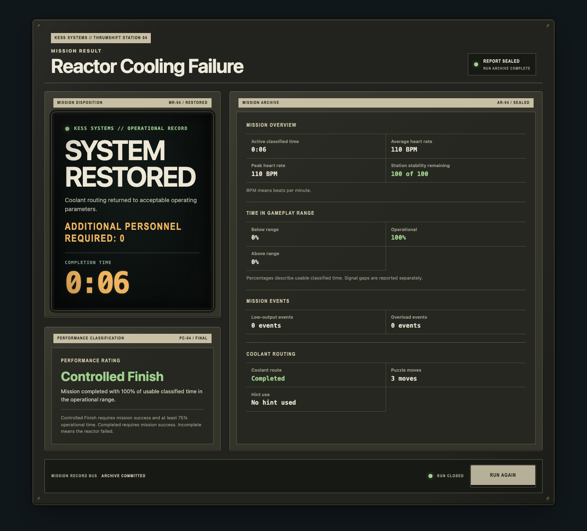
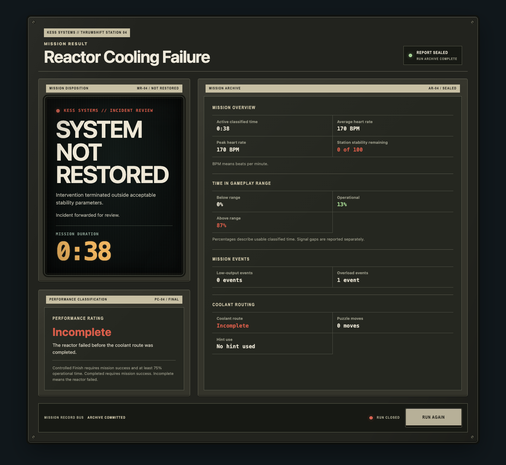
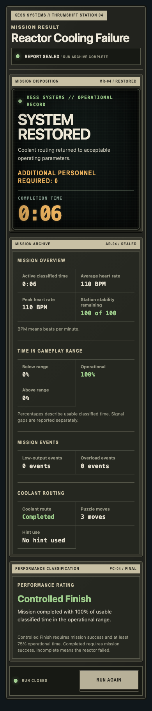
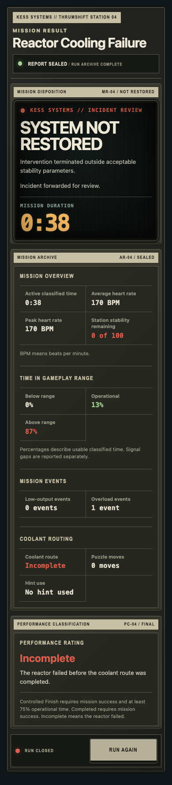

# Mission result visual-system rollout

Mission results extend the approved equipment system as terminal run reports. Success and failure share one installed report console, data hierarchy, and replay control; outcome-specific labels and limited semantic color communicate the final system state. Existing result accessibility text, heading order, focus behavior, and replay flow remain unchanged, while the outcome copy now frames the run as a Kess Systems operational record.

## Shared terminal-report console

- The result uses an `equipment-shell` with the established station plate, desktop fasteners, printed module strips, serviceable bays, status lamps, and physical control deck.
- The mission-disposition CRT carries only the large outcome, concise summary, and completion/duration value. Detailed history remains on a non-CRT archival ledger for sustained readability.
- The archive groups overview, gameplay range, mission events, routing, signal gaps, and interruptions as compact ruled metric rows rather than independent cards.
- Performance classification occupies a separate physical bay. The criteria remain available without competing with the primary outcome.
- The bottom control deck marks the run as closed and retains the existing `Run Again` action.

## Success and failure distinction

- Success is identified as `SYSTEM RESTORED`, `KESS SYSTEMS // OPERATIONAL RECORD`, and `MR-04 / RESTORED`. The successful disposition carries the dry staffing record `ADDITIONAL PERSONNEL REQUIRED: 0`. Green is limited to the restored-state lamp, confirmed healthy values, completed route, and successful performance classification.
- Failure is identified as `SYSTEM NOT RESTORED`, `KESS SYSTEMS // INCIDENT REVIEW`, and `MR-04 / NOT RESTORED`. The failed disposition carries the bureaucratic note `Incident forwarded for review.` Red is limited to the failure-state lamp, zero station stability, incomplete route, above-range history when present, and the incomplete classification.
- Outcome headings remain neutral cream. Failure does not alter the enclosure, backdrop, or whole display to red and does not use “game over” language.
- Zero-percent below/above values remain neutral. Semantic warning colors appear only when the corresponding condition actually occurred.
- Both outcomes retain the same metrics and report structure, making the difference legible as machine state rather than celebration or punishment.

## Responsive density

- Desktop places disposition and performance classification in the left instrument column and the detailed mission archive in the wider right ledger.
- At 390px the bays stack in semantic order: disposition, archive, performance classification, then replay controls.
- Mobile removes fasteners and redundant control-bus wording through the existing density rules while preserving module strips, CRT framing, tabular values, status lamps, and full-size touch controls.
- Metric rows remain two columns at 390px and collapse to one column only at the ultra-narrow breakpoint.

## Review captures

