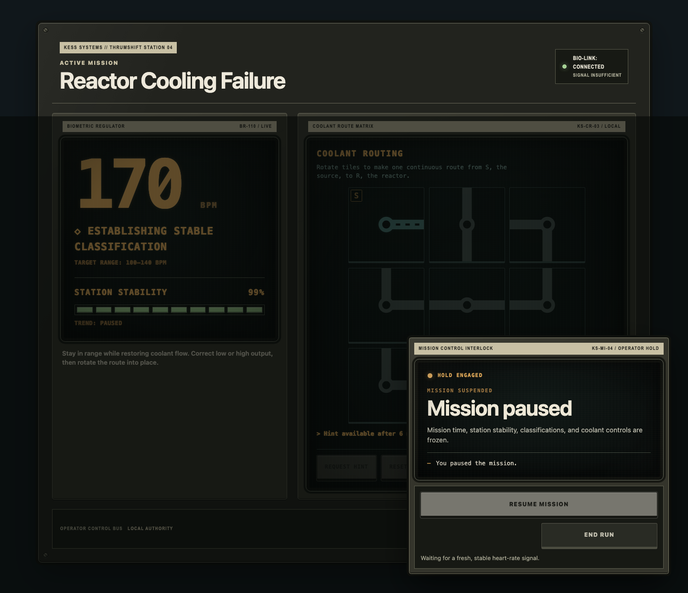
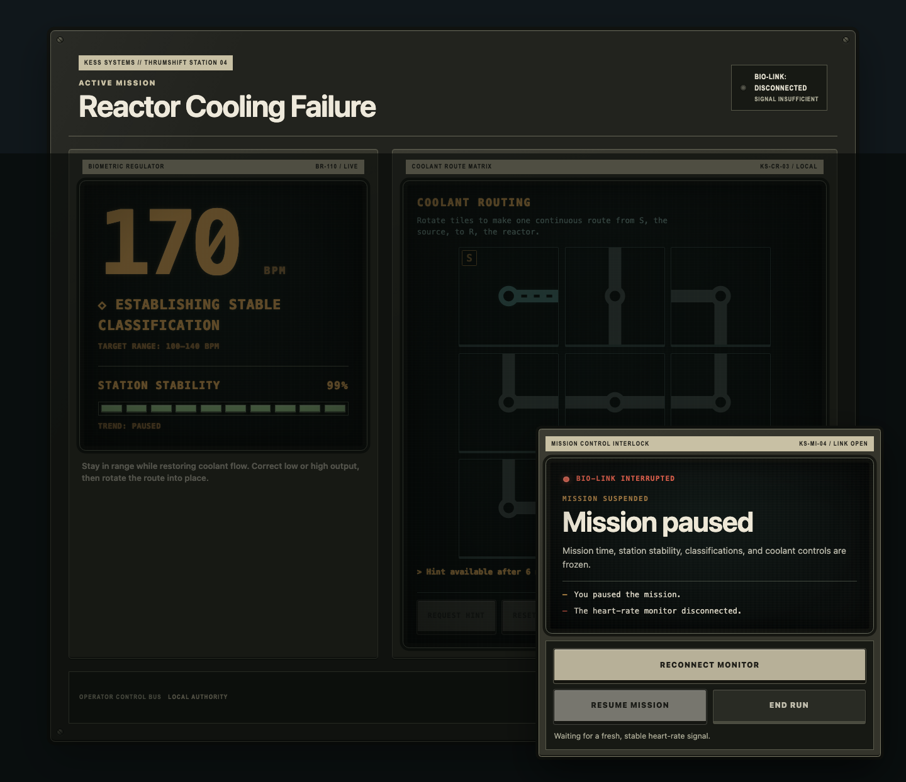
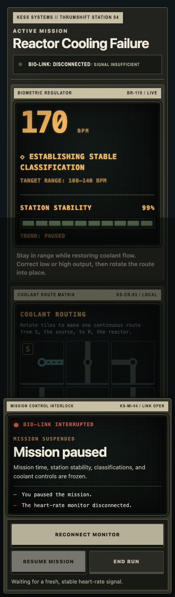

# Mission suspension visual-system rollout

Mission suspension extends the approved active-gameplay console as a temporary service interlock. The active mission remains visible and frozen behind the interruption; the panel does not replace it with a new screen or imply that the run has failed. Existing dialog semantics, focus management, reconnect behavior, reason reporting, and explicit resume flow remain unchanged.

## Shared interruption enclosure

- The native modal dialog is presented as a docked `KS-MI-04` mission-control interlock rather than a generic centered web modal.
- A printed equipment strip identifies the subsystem and current interlock mode. The recessed CRT surface contains state, explanation, and suspension reasons; the physical control bank contains recovery and end-run actions.
- The backdrop is dark enough to establish input priority but remains translucent and unblurred so mission identity, telemetry, stability, and routing context remain recognizable.
- “Mission paused” remains the semantic heading. “Mission suspended,” the frozen-state explanation, and explicit reason text distinguish this temporary state from mission failure.
- No flashing, animation, full-surface warning color, or additional instrumentation is introduced.

## Manual and disconnect distinction

- Manual suspension is an amber `OPERATOR HOLD`. Its lamp and short state label communicate a deliberate, reversible hold; Resume is the primary action.
- Disconnect suspension is a `LINK OPEN` condition. Red is limited to the bio-link lamp, interrupted-state label, and disconnect reason marker.
- Disconnect recovery places Reconnect first and full-width. Resume remains present but visibly interlocked until page visibility and a fresh, stable signal permit continuation.
- End Run remains a visually secondary physical control in both modes. It is not styled as an alarm or failure action.

## Responsive density

- Desktop docks the interlock toward the lower-right control area, leaving the mission header and critical telemetry exposed.
- At 390px the interlock becomes a bottom service tray with reduced casing and CRT padding. The mission identity, bio-link state, and upper telemetry remain visible above it.
- Reconnect retains a full-width touch target. Resume and End Run share the secondary control row; at ultra-narrow widths they stack.
- Printed identifiers, the warning lamp, CRT edge treatment, reason text, and comfortable touch targets are preserved as framing density decreases.

## Review captures

