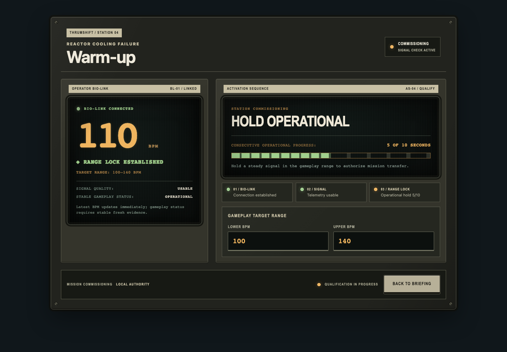
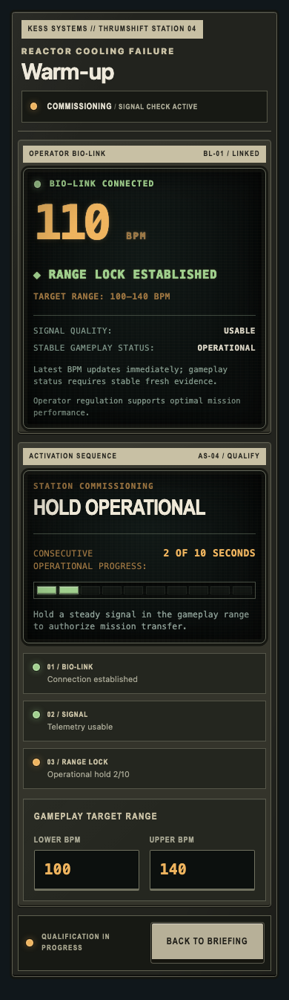
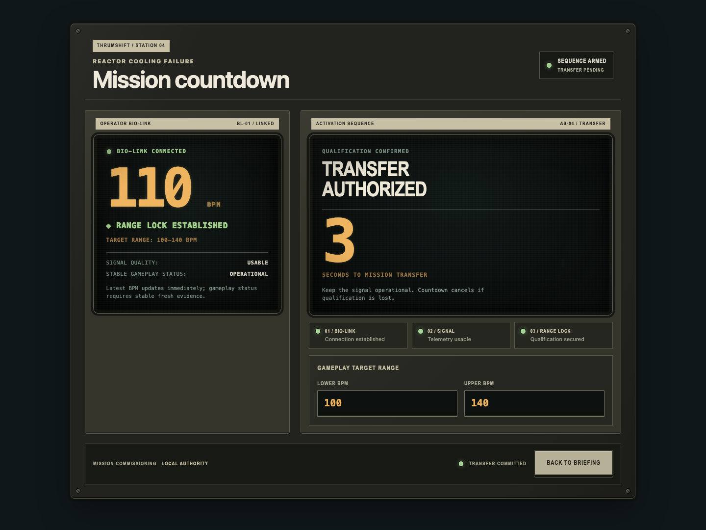
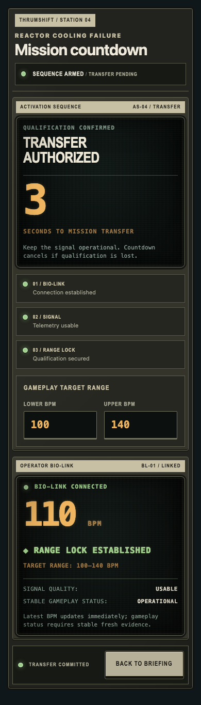

# Mission warm-up and countdown visual-system rollout

The mission commissioning sequence bridges the approved briefing and active-gameplay consoles. It preserves the existing 10-second operational qualification and 3-second countdown while presenting both as progressive activation of installed station equipment rather than a loading screen.

## Shared equipment composition

- Both phases use the established equipment shell, station identity plate, module label strips, recessed CRT displays, persistent status block, and physical control deck.
- The left bio-link bay keeps live BPM, target range, signal quality, and stable gameplay classification visible throughout commissioning.
- The right activation-sequence bay owns procedure state, readiness stages, editable target parameters, and transfer timing. No new gameplay data or decorative instruments are introduced.
- Concise system language describes the procedure: acquire signal, stabilize input, correct to range, hold operational, and transfer authorized.

## Progressive warm-up

- Three persistent service stages make readiness legible: bio-link connection, usable telemetry, and operational range lock.
- The existing qualification duration is shown as a ten-lamp station bank with an explicit elapsed value. One additional lamp illuminates only when a whole qualifying second completes; there is no interpolated fill or sweep.
- Native progress semantics remain available to assistive technology while the visible readout uses the shared physical lit/unlit lamp construction.
- Stage lamps use the shared `healthy`, `warning`, `critical`, and `inactive` semantics, always paired with text.
- Live telemetry remains the visual anchor while the activation bay explains what evidence the station is accepting next.

## Countdown handoff

- Qualification converts the activation CRT into a sparse `TRANSFER AUTHORIZED` readout with the existing remaining seconds.
- The numeral uses the instrument type and restrained amber phosphor treatment. It stays inside the station display instead of becoming a full-screen arcade overlay.
- Console identity, bio-link telemetry, readiness stages, parameters, and control state remain visible, making the countdown feel like a committed equipment procedure.
- The established behavior is unchanged: loss of qualification cancels the countdown, and completion transfers directly into active gameplay.

## Responsive equipment density

- Desktop uses two installed bays, with telemetry on the left and the wider procedure bay on the right.
- At 390px warm-up follows the physical reading order of telemetry, procedure, stages, parameters, and controls.
- During mobile countdown, the activation-sequence bay moves ahead of the bio-link bay so the immediate transfer state is visible first. The bio-link remains present below it as retained console context.
- Fasteners, redundant legends, and excess enclosure depth reduce at the narrow breakpoint. Module strips, CRT recesses, readable telemetry, full-size fields, and touch targets remain.

## Review captures

